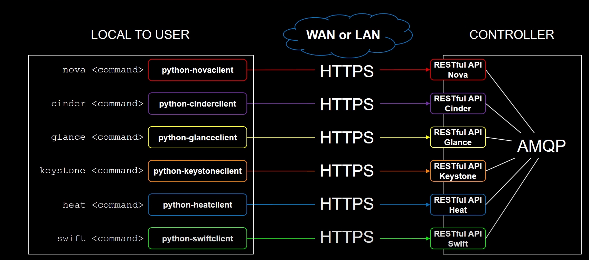

# OpenStackSDK

## Introduction

> On this repo you will find information related to the OpenStackSDK, the scope of this repo is mostly list, modify, create, and delete resources on your OpenStack enviroment, through the SDK interface.
> In order to do so, there is some requirements that you have to fullfil in order to have access to the OpenStack Enviromen.
> The way that we will interact with the OpenStack platform is the follwing:

> As can we see on the image, the openstack open the differents services that can be consumed from outside through SDK, stablishing a HTTPS tunnel to "talk" with the differents endpoints in order to obtain a response.

## Pre-Requisits

> For all works fine, depending your platform you should have to prepare your enviroment with the follwing considerations:

SDK Requisitos (click para expandir)

> Required software

> In my case, on the moment to test all this, I have to do it on Windows, but probably for you can be different the requirements, depending your operating system.

- Install [Python](https://www.python.org/downloads/)
- Upgrade [pip](https://www.wikihow.com/Update-Pip)
- Install [Microsoft Visual C++](https://learn.microsoft.com/es-es/cpp/windows/latest-supported-vc-redist?view=msvc-170)
- Install [OpenStack SDK](https://docs.openstack.org/openstacksdk/latest/install/index.html)

> Configuration

1. Create "Connection Object"
2. Specify the service type that you have to query
3. Specify the resource type that you have to query
4. Specify the version of the component that you want to modify, create, delete or list.

